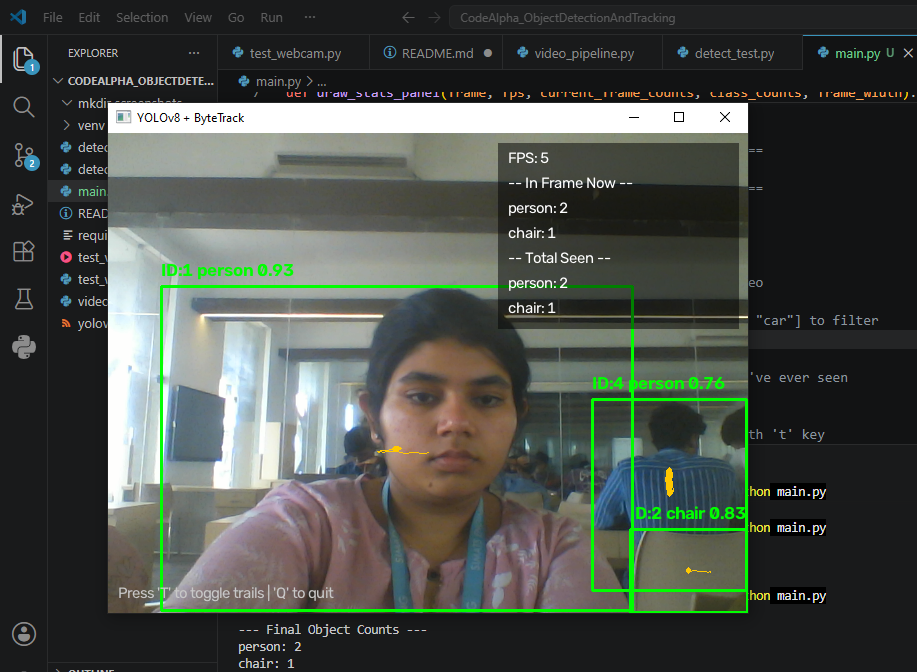
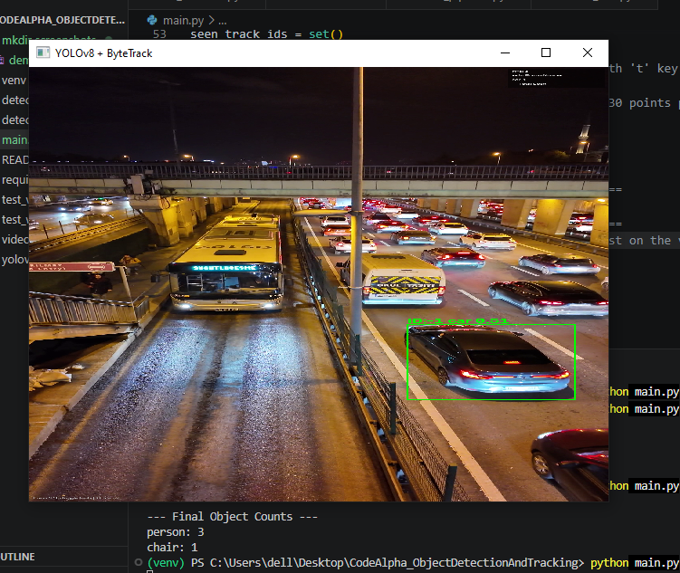

# CodeAlpha - Object Detection and Tracking

Real-time object detection and multi-object tracking system built with YOLOv8 and ByteTrack, using OpenCV for video I/O. Supports both live webcam feed and video file input, with live on-screen statistics, motion trail visualization, and annotated output saving.

## Features

- **Real-time object detection** using YOLOv8 (nano), pretrained on the COCO dataset (80 object classes)
- **Multi-object tracking** via ByteTrack, assigning persistent IDs to detected objects across frames
- **Live stats panel** showing FPS, objects currently in frame, and total unique objects seen
- **Motion trails** - toggle live with the 'T' key, showing each tracked object's recent movement path with a fading effect
- **Confidence threshold filtering** to control detection reliability
- **Optional class filtering** (e.g., detect only "person" and "car")
- **Annotated output video saving**, with playback speed accurately matched to real processing FPS (not sped up)
- Works with both webcam (live) and pre-recorded video files

## Tech Stack

- Python 3.14
- OpenCV - video I/O, rendering
- Ultralytics YOLOv8 (nano) - object detection
- ByteTrack (via Ultralytics) - multi-object tracking
- FilterPy + SciPy - included for potential custom tracking experiments (Kalman filter, Hungarian algorithm)

## How to Run

1. Clone this repo:
git clone 
https://github.com/NiharikaGupta28/CodeAlpha_ObjectDetectionAndTracking.git
cd CodeAlpha_ObjectDetectionAndTracking

2. Create and activate a virtual environment:
- python -m venv venv
- venv\Scripts\activate

3. Install dependencies:
pip install -r requirements.txt

4. Run the main application:
- By default, uses your webcam (`source = 0`) — edit this line in `main.py` to use a video file instead (e.g., `source = "test_video.mp4"`)
   - Press **T** to toggle motion trails on/off live
   - Press **Q** to quit
   - Set `SAVE_OUTPUT = True` in the config section to save an annotated output video

## Configuration Options

All key settings are in the CONFIGURATION section at the top of `main.py`:

| Variable | Purpose | Default |
|---|---|---|
| `CONFIDENCE_THRESHOLD` | Minimum confidence to display a detection | `0.5` |
| `SAVE_OUTPUT` | Save annotated video to file | `False` |
| `CLASSES_TO_DETECT` | Restrict detection to specific classes, or `None` for all | `None` |
| `source` | `0` for webcam, or a filename string for a video file | `0` |

## Known Limitations

- **Detection is limited to 80 COCO object classes** - objects outside this set (e.g., earbuds) cannot be detected regardless of visibility.
- **Small or distant objects** (e.g., a computer mouse) may be inconsistently detected, particularly with the lightweight nano model and reduced processing resolution (`imgsz=320`, chosen for real-time CPU performance).
- **Dim lighting reduces detection reliability**, especially for objects with fine visual detail.
- **Fast movement can cause brief detection/bounding-box flicker**, since detection runs independently per frame with no motion smoothing.
- **Track IDs reset when an object fully exits and re-enters the frame.** ByteTrack uses motion-based matching (IoU + Kalman filter prediction), not appearance-based re-identification. This means a person leaving and re-entering frame will be assigned a new ID, and object counts reflect unique tracked appearances rather than unique real-world individuals. Deep SORT addresses this with appearance embeddings but was not used here due to CPU-only hardware constraints (tested on Intel i5-4210U, no dedicated GPU).
- Tested performance: ~7-8 FPS on CPU-only hardware (no GPU) at `imgsz=320`; would be significantly faster with a modern CPU or GPU acceleration.
- On dark, high-resolution footage with small/distant/fast-moving objects (e.g., nighttime traffic video), detections still occur but bounding boxes/labels can be visually small and hard to distinguish - a rendering/visibility consideration rather than a detection failure.

## Development Process

This project was built incrementally over several days, with deliberate testing and documentation at each stage (see commit history for full detail):

- **Day 1:** Environment setup, webcam verification, repo initialization
- **Day 2:** Reusable video pipeline (webcam + file support), FPS tracking, output saving
- **Day 3:** YOLOv8 detection integration, confidence filtering, adaptive box/text scaling, CPU performance optimization
- **Day 4:** Class filtering, systematic robustness testing (lighting, distance, movement, occlusion)
- **Day 5:** ByteTrack integration, investigation and documentation of ID-switching behavior and tracker tuning
- **Day 6:** Creative additions - object counting, live stats panel, output saving fix, toggleable motion trails
- **Day 7:** Full regression/robustness testing, edge case verification
- **Day 9:** Final code cleanup, documentation polish

## Author

Niharika - B.Tech AI & Machine Learning, developed as part of a CodeAlpha internship project.